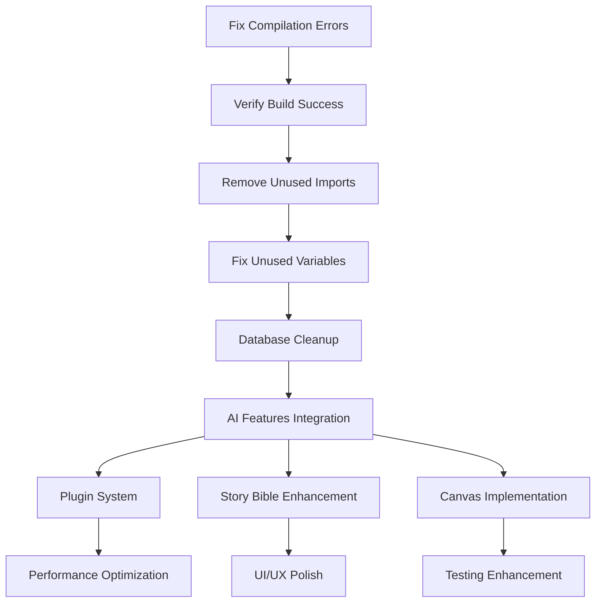

# JSG-StoryWeaver Codebase Action Plan

**Generated:** January 14, 2025  
**Project Status:** Phase 1 (99% Complete) → Phase 2 (In Progress)  
**Build Status:** ✅ No Compilation Errors, 147 Warnings (cargo check)  
**Overall Health:** 7.5/10 (Reduced due to build failures)

## 📋 Executive Summary

StoryWeaver is a comprehensive AI-powered desktop writing application with a solid foundation but currently faces critical compilation issues that prevent successful builds. The project has extensive features implemented but needs immediate attention to resolve build errors and technical debt before continuing development.

**Immediate Priority:** Fix compilation errors to restore build functionality  
**Secondary Priority:** Clean up technical debt and complete missing integrations  
**Long-term Priority:** Performance optimization and feature completion

---

## 🚨 CRITICAL PRIORITY TASKS

### Milestone A: Restore Build Functionality

#### Task A1: Fix Compilation Errors

- **Priority:** Critical
- **Estimated Effort:** 2-4 hours
- **Dependencies:** None
- **Files Affected:**
  - `src-tauri/src/commands/advanced_ai_commands.rs`
  - `src-tauri/src/ai/openai.rs`

**Issues to Fix:**

- [✅] **Error 1:** Type mismatch in `advanced_ai_commands.rs:259` - `Vec<&ProseMode>` vs `Vec<ProseMode>`

  ```rust
  // Current (broken):
  Ok(ai_manager.get_prose_modes().to_vec())
  // Fix:
  Ok(ai_manager.get_prose_modes().iter().cloned().collect())
  ```

- [✅] **Error 2:** Type mismatch in `advanced_ai_commands.rs:268` - `Option<&ProseMode>` vs `Option<ProseMode>`

  ```rust
  // Current (broken):
  .find(|mode| mode.name == mode_name).cloned()
  // Fix:
  .find(|mode| mode.name == mode_name).map(|m| m.clone())
  ```

- [✅] **Error 3:** String reference error in `openai.rs:1589` - `String` vs `&str`

  ```rust
  // Current (broken):
  Err(StoryWeaverError::ai_request("OpenAI", status.as_u16(), error_text))
  // Fix:
  Err(StoryWeaverError::ai_request("OpenAI", status.as_u16(), &error_text))
  ```

#### Task A2: Verify Build Success

- **Priority:** Critical
- **Estimated Effort:** 30 minutes
- **Dependencies:** Task A1

- [ ] Run `cargo check` to verify no compilation errors
- [ ] Run `cargo build` to ensure successful build
- [ ] Run `npm run build` to verify frontend builds
- [ ] Test basic application startup

---

## 🔧 HIGH PRIORITY TASKS

### Milestone B: Technical Debt Cleanup

#### Task B1: Remove Unused Imports (Phase 1)

- **Priority:** High
- **Estimated Effort:** 4-6 hours
- **Dependencies:** Task A1, A2

**Critical Files with Unused Imports:**

- [ ] `src/commands/story_bible.rs` - Remove unused `Serialize`
- [ ] `src/commands/ai_history.rs` - Remove unused `CommandResponse`
- [ ] `src/commands/ai_writing.rs` - Remove unused `RewriteStyle`, `Manager`
- [ ] `src/commands/folder_commands.rs` - Remove unused `Serialize`
- [ ] `src/commands/series_commands.rs` - Remove unused `Serialize`
- [ ] `src/commands/document_link_commands.rs` - Remove unused `Serialize`
- [ ] `src/commands/settings_commands.rs` - Remove unused `Serialize`
- [ ] `src/commands/performance_commands.rs` - Remove unused imports (5 items)
- [ ] `src/commands/templates.rs` - Remove unused imports (6 items)
- [ ] `src/commands/advanced_ai_commands.rs` - Remove unused `CommandResponse`, `StoryWeaverError`

#### Task B2: Fix Unused Variables

- **Priority:** High
- **Estimated Effort:** 2-3 hours
- **Dependencies:** Task B1

**Key Variables to Address:**

- [ ] `src/commands/documents.rs:181` - Fix unused `tree` variable
- [ ] `src/commands/ai_writing.rs` - Fix unused `settings` parameters (4 instances)
- [ ] `src/commands/sync_commands.rs:43` - Fix unused `app_handle`
- [ ] `src/database/operations/` - Multiple unused variables across operations files
- [ ] `src/ai/` - Multiple unused variables in AI provider implementations

#### Task B3: Database Operations Cleanup

- **Priority:** High
- **Estimated Effort:** 3-4 hours
- **Dependencies:** Task B1

**Database Issues:**

- [ ] Remove unused imports in `database/operations/mod.rs` (20+ unused exports)
- [ ] Clean up unused model imports in `database/models.rs`
- [ ] Fix unused variables in database operation functions
- [ ] Review and optimize database connection usage

---

## 🔄 MEDIUM PRIORITY TASKS

### Milestone C: Feature Integration Completion

#### Task C1: AI Writing Features Integration

- **Priority:** Medium
- **Estimated Effort:** 8-12 hours
- **Dependencies:** Milestone A, B

**Missing Integrations:**

- [ ] Complete streaming text generation implementation
- [ ] Connect AI writing tools to frontend UI
- [ ] Implement proper error handling for AI operations
- [ ] Add credit tracking and cost estimation
- [ ] Complete Quick Tools (Quick Edit/Quick Chat) integration

#### Task C2: Plugin System Completion

- **Priority:** Medium
- **Estimated Effort:** 6-8 hours
- **Dependencies:** Task C1

**Plugin System Tasks:**

- [ ] Complete plugin execution engine
- [ ] Implement plugin testing environment
- [ ] Add plugin marketplace functionality
- [ ] Complete variable injection system
- [ ] Add plugin security validation

#### Task C3: Story Bible System Enhancement

- **Priority:** Medium
- **Estimated Effort:** 4-6 hours
- **Dependencies:** Task C1

**Story Bible Tasks:**

- [ ] Complete character and worldbuilding CRUD operations
- [ ] Implement visibility controls for AI access
- [ ] Add series-level sharing functionality
- [ ] Complete outline-to-document linking
- [ ] Implement Story Bible detection in text

#### Task C4: Canvas/Visual Planning

- **Priority:** Medium
- **Estimated Effort:** 10-12 hours
- **Dependencies:** Task C1

**Canvas Implementation:**

- [ ] Complete React frontend for canvas
- [ ] Implement drag-and-drop functionality
- [ ] Add outline template system
- [ ] Complete export functionality
- [ ] Add keyboard shortcuts support

---

## 🚀 LOW PRIORITY TASKS

### Milestone D: Performance and Polish

#### Task D1: Performance Optimization

- **Priority:** Low
- **Estimated Effort:** 6-8 hours
- **Dependencies:** Milestone C

**Performance Tasks:**

- [ ] Optimize database queries with proper indexing
- [ ] Implement caching for AI responses
- [ ] Add lazy loading for large documents
- [ ] Optimize memory usage in streaming operations
- [ ] Add performance monitoring and metrics

#### Task D2: Code Quality Improvements

- **Priority:** Low
- **Estimated Effort:** 4-6 hours
- **Dependencies:** Milestone B

**Code Quality Tasks:**

- [ ] Add comprehensive error handling patterns
- [ ] Implement proper logging throughout application
- [ ] Add input validation for all user inputs
- [ ] Improve code documentation and comments
- [ ] Add type safety improvements

#### Task D3: Testing Enhancement

- **Priority:** Low
- **Estimated Effort:** 8-10 hours
- **Dependencies:** Milestone C

**Testing Tasks:**

- [ ] Expand unit test coverage for core functions
- [ ] Add integration tests for AI operations
- [ ] Enhance E2E test coverage for new features
- [ ] Add performance testing for large documents
- [ ] Implement automated testing in CI/CD

#### Task D4: UI/UX Polish

- **Priority:** Low
- **Estimated Effort:** 6-8 hours
- **Dependencies:** Task C1, C3

**UI/UX Tasks:**

- [ ] Implement responsive design improvements
- [ ] Add accessibility features and ARIA labels
- [ ] Enhance error messaging and user feedback
- [ ] Implement loading states and progress indicators
- [ ] Add keyboard shortcuts and hotkeys

---

## 🔍 SECURITY AND RELIABILITY TASKS

### Milestone E: Security Hardening

#### Task E1: Input Validation Enhancement

- **Priority:** Medium
- **Estimated Effort:** 4-6 hours
- **Dependencies:** Milestone A

**Security Tasks:**

- [ ] Implement comprehensive input sanitization
- [ ] Add rate limiting for AI API calls
- [ ] Enhance file upload validation
- [ ] Implement proper authentication for collaboration features
- [ ] Add audit logging for security events

#### Task E2: Error Handling Standardization

- **Priority:** Medium
- **Estimated Effort:** 3-4 hours
- **Dependencies:** Task E1

**Error Handling Tasks:**

- [ ] Standardize error responses across all endpoints
- [ ] Implement proper error logging without information disclosure
- [ ] Add graceful degradation for AI service failures
- [ ] Implement retry logic with exponential backoff
- [ ] Add error recovery mechanisms

---

## 📊 DEPENDENCY ANALYSIS

### Critical Path Dependencies



### Parallel Development Opportunities

**Can be worked on simultaneously after Milestone A:**

- Task B1 (Unused Imports) + Task E1 (Input Validation)
- Task B2 (Unused Variables) + Task E2 (Error Handling)
- Task C2 (Plugin System) + Task C3 (Story Bible) after Task C1

---

## 🎯 RISK ASSESSMENT

### High Risk Items

- **Compilation Errors:** Blocking all development until resolved
- **AI Integration:** Complex async operations with potential race conditions
- **Database Operations:** Risk of data corruption during cleanup

### Medium Risk Items

- **Plugin System:** Security implications of user-generated code
- **Performance:** Large document handling may cause memory issues
- **Canvas Implementation:** Complex UI interactions may introduce bugs

### Low Risk Items

- **Unused Imports:** Safe cleanup with minimal impact
- **UI Polish:** Cosmetic changes with low technical risk
- **Testing:** Additive improvements with no breaking changes

---

## 📈 SUCCESS METRICS

### Milestone A Success Criteria

- [ ] Zero compilation errors
- [ ] Successful `cargo build` and `npm run build`
- [ ] Application starts without crashes
- [ ] Basic functionality verified

### Milestone B Success Criteria

- [ ] <20 compiler warnings (down from 114)
- [ ] No unused imports in critical files
- [ ] Clean `cargo clippy` output
- [ ] Improved build times

### Milestone C Success Criteria

- [ ] All AI writing features functional
- [ ] Plugin system operational
- [ ] Story Bible fully integrated
- [ ] Canvas implementation complete

### Overall Project Success Criteria

- [ ] Build success rate: 100%
- [ ] Test coverage: >80%
- [ ] Performance: <2s startup time
- [ ] User experience: Smooth, responsive interface

---

## 🛠️ IMPLEMENTATION STRATEGY

### Phase 1: Emergency Fixes (Days 1-2)

1. **Day 1 Morning:** Fix compilation errors (Task A1)
2. **Day 1 Afternoon:** Verify builds and basic functionality (Task A2)
3. **Day 2:** Begin unused import cleanup (Task B1)

### Phase 2: Technical Debt (Days 3-7)

1. **Days 3-4:** Complete import cleanup and fix unused variables
2. **Days 5-6:** Database operations cleanup
3. **Day 7:** Code review and testing

### Phase 3: Feature Integration (Days 8-21)

1. **Days 8-12:** AI writing features integration
2. **Days 13-16:** Plugin system completion
3. **Days 17-19:** Story Bible enhancement
4. **Days 20-21:** Canvas implementation

### Phase 4: Polish and Optimization (Days 22-28)

1. **Days 22-24:** Performance optimization
2. **Days 25-26:** UI/UX polish
3. **Days 27-28:** Final testing and documentation

---

## 📋 TASK TRACKING TEMPLATE

### Task Status Legend

- [ ] **Not Started** - Task not yet begun
- [🔄] **In Progress** - Task currently being worked on
- [⚠️] **Blocked** - Task blocked by dependencies or issues
- [✅] **Complete** - Task finished and verified
- [❌] **Failed** - Task attempted but failed, needs rework

### Weekly Review Checklist

- [ ] Review completed tasks and update status
- [ ] Identify any new issues or dependencies
- [ ] Adjust timeline based on actual progress
- [ ] Update risk assessment for upcoming tasks
- [ ] Plan next week's priorities

---

## 🔄 CONTINUOUS IMPROVEMENT

### Post-Completion Actions

1. **Retrospective:** Analyze what worked well and what didn't
2. **Documentation:** Update development guidelines based on lessons learned
3. **Automation:** Implement CI/CD improvements to prevent similar issues
4. **Monitoring:** Set up ongoing code quality monitoring
5. **Training:** Share knowledge with team about best practices discovered

### Future Maintenance

- **Weekly:** Run automated code quality checks
- **Monthly:** Review and update dependencies
- **Quarterly:** Comprehensive security and performance review
- **Annually:** Architecture review and modernization planning

---

**Total Estimated Effort:** 60-80 hours  
**Recommended Timeline:** 4-6 weeks  
**Team Size:** 2-3 developers  
**Success Probability:** High (with proper execution of critical path)

*This action plan should be reviewed and updated weekly as tasks are completed and new issues are discovered.*
